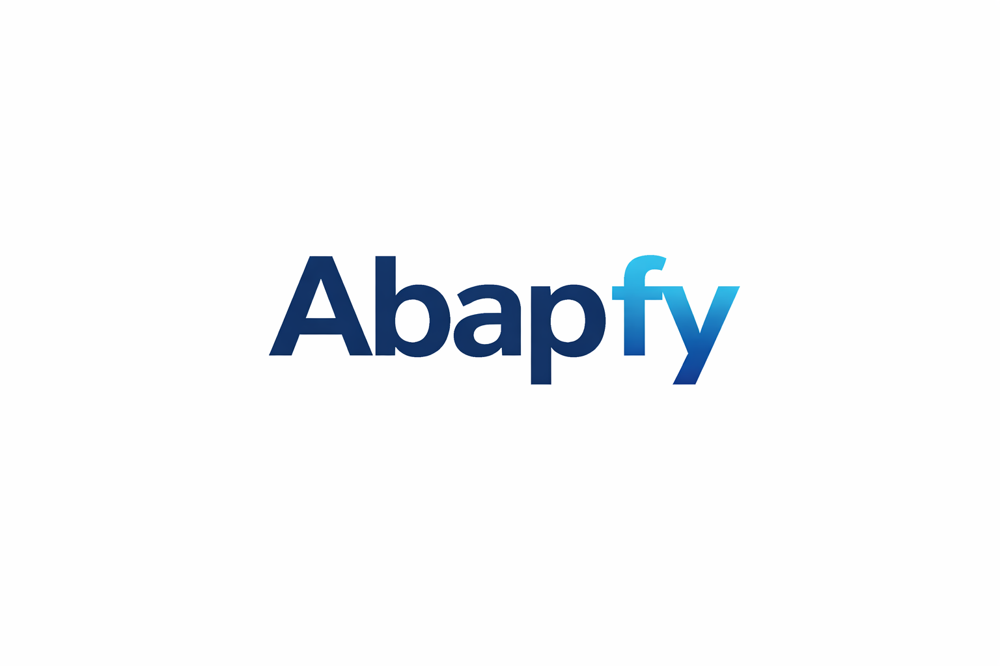

<div align="center">



# Abapfy

**Plataforma de IA para consultores e desenvolvedores SAP**

[](https://github.com/esc4n0rx/Abapfy/releases)
[](https://electronjs.org)
[](https://reactjs.org)
[](https://supabase.com)
[](LICENSE)

</div>

---

## Sobre

**Abapfy** é uma plataforma desktop que integra Inteligência Artificial diretamente no fluxo de trabalho de consultores e desenvolvedores SAP. Com suporte a múltiplos provedores de IA (Claude, Gemini, OpenAI, Groq e CLIs locais), o Abapfy cobre todo o ciclo de desenvolvimento: desde a especificação funcional até a geração de código, revisão técnica, análise de performance e documentação.

A interface segue o design system **SAP Fiori / UI5** — familiar para quem já trabalha no ecossistema SAP — com suporte completo a tema claro e escuro.

---

## Módulos

| Módulo | Descrição |
|--------|-----------|
| **Gerador ABAP** | Geração assistida de REPORTs, Function Modules, Classes, Enhancements e Programas com validação de sintaxe e auto-correção |
| **Code Review** | Análise estática com IA: bugs, performance, segurança, dead code, boas práticas SAP — com chat de follow-up |
| **Análise de Performance** | Detecta anti-patterns (SELECT em LOOP, N+1, ausência de índices) com score, impacto e código corrigido aplicável |
| **Enhancement Finder** | Identifica BAdIs, User Exits e Enhancement Spots para um requisito — com RAG sobre base local do sistema |
| **Especificações Funcionais** | Criação de EFs completas via IA com exportação para documento Word (.docx) pronto para entrega |
| **Estimativa de Esforço** | Análise de EFs e geração de estimativa de horas por fase (análise, desenvolvimento, testes, UAT, documentação) |
| **DTec** | Geração de Documentação Técnica estruturada a partir do código-fonte ABAP |
| **Agentes** | Gerenciamento de agentes de IA — padrões (armazenados no banco, disponíveis para todos) e personalizados por usuário |
| **Histórico** | Acesso ao histórico de gerações ABAP, code reviews e especificações salvas no Supabase |
| **Snippet Library** | Biblioteca de trechos de código ABAP reutilizáveis |

---

## Provedores de IA

O Abapfy suporta dois modelos de integração:

### Via API (cloud)

| Provedor | Modelo padrão | Observação |
|----------|---------------|------------|
| **Claude** (Anthropic) | `claude-sonnet-4-6` | Recomendado para geração de código |
| **Gemini** (Google) | `gemini-2.0-flash` | Boa relação custo-benefício |
| **OpenAI** | `gpt-4o` | Alta compatibilidade |
| **Groq** | `qwen/qwen3-32b` | Mais rápido, ideal para revisões rápidas |

### Via CLI (local — sem API key)

| Ferramenta | Instalação |
|------------|-----------|
| **Claude Code** | `npm install -g @anthropic-ai/claude-code` |
| **Codex CLI** | `npm install -g @openai/codex` |

> Integrações CLI têm **prioridade** sobre provedores API quando habilitadas. Não requerem chave de API.

---

## Detalhes por Módulo

### Gerador ABAP

Suporta 5 tipos de objeto SAP:

| Tipo | Objeto |
|------|--------|
| `REPORT` | Relatório com tela de seleção e saída ALV |
| `FUNC` | Function Module com interface IMPORTING/EXPORTING |
| `CLAS` | Classe ABAP (OOP) com atributos e métodos |
| `ENHO` | Enhancement — BAdI ou Enhancement Spot |
| `PROG` | Programa simples sem tela de seleção |

**Funcionalidades:**
- Formulário guiado por tipo de objeto (tabelas, regras de negócio, parâmetros, interfaces)
- Validação de sintaxe ABAP via SE38 (quando disponível via IPC)
- Auto-correção automática em até 5 tentativas quando há erros de sintaxe
- Geração de múltiplos arquivos (programa principal + includes)
- Cópia individual por arquivo ou "Copiar Tudo" — sem markdown, pronto para colar no SE38
- Histórico salvo automaticamente no Supabase

### Análise de Performance

Analisa código ABAP e detecta anti-patterns categorizados por severidade:

| Severidade | Exemplos |
|------------|----------|
| **Critical** | SELECT dentro de LOOP (N+1), SELECT sem WHERE em tabela transacional |
| **High** | Nested LOOP sem otimização, ausência de HASHED TABLE para lookups |
| **Medium** | COLLECT sem SORTED TABLE, CONCATENATE dentro de LOOP |
| **Low** | Variáveis não usadas, tipos obsoletos (LIKE em vez de TYPE) |

- Score de 0 a 100 com resumo da análise
- Cada problema inclui descrição, impacto e código corrigido
- Seleção individual de correções via checkbox
- **"Aplicar correções selecionadas"**: IA gera o código completo com todas as fixes aplicadas de uma vez
- Modal com código corrigido + botão copiar (pronto para SE38)

### Enhancement Finder

Identifica os melhores pontos de ampliação SAP para um requisito de negócio:

- Ranqueia de 3 a 6 opções (BAdI, User Exit, Enhancement Spot, Customer Exit)
- Indica compatibilidade com **S/4HANA**
- Exibe vantagens, limitações e transação de ativação (SE19, SMOD, etc.)
- Esqueleto de código ABAP de implementação com botão copiar
- **RAG integrado**: quando habilitado, pesquisa na base local de BAdIs do sistema (arquivo CSV) e instrui a IA a usar apenas os BAdIs existentes — sem invenções

### Code Review

- Análise inicial retorna JSON estruturado com findings por severidade
- Cada finding inclui: arquivo, linha, código original, sugestão de correção e impacto
- Verdict: `approved`, `approved_with_changes` ou `rejected`
- Chat de follow-up em markdown para dúvidas sobre a análise
- Salvo em sessões no Supabase para consulta posterior

### Especificações Funcionais (EF)

- Contexto informal → EF profissional formatada
- Campos gerados: nome do projeto, cliente, descrição, macro overview, especificação funcional completa
- Exportação para **Word (.docx)** via template com substituição de placeholders
- Arquivo salvo em `Documentos/Abapfy/EspecificacoesFuncionais/`
- Histórico de EFs no Supabase

### Agentes

O sistema de agentes permite personalizar o comportamento da IA em cada fluxo:

**Agentes padrão** (gerenciados pelo administrador via Supabase):
- Armazenados na tabela `default_agents`
- Disponíveis para todos os usuários autenticados
- Atualizáveis sem novo deploy do app

**Agentes personalizados** (por usuário):
- Criados, editados e excluídos pelo próprio usuário
- Armazenados na tabela `user_agents` com RLS
- Podem ser duplicados a partir de agentes padrão

**Configuração por fluxo**: cada módulo pode ser associado a um agente diferente (padrão ou personalizado) via dropdown.

---

## Arquitetura

```
┌─────────────────────────────────────────────────────────────┐
│                       Abapfy (Electron)                      │
│                                                             │
│  ┌──────────────────┐    IPC Bridge    ┌─────────────────┐  │
│  │    Renderer       │ ◄──────────────► │  Main Process   │  │
│  │   (React 18)      │                  │   (Node.js)     │  │
│  │                   │                  │                 │  │
│  │  Views            │                  │  AI providers   │  │
│  │  Zustand Stores   │                  │  DOCX engine    │  │
│  │  Components       │                  │  File system    │  │
│  │  AI Client        │                  │  Notificações   │  │
│  └────────┬──────────┘                  └────────┬────────┘  │
│           │                                      │           │
│           ▼                                      ▼           │
│  ┌──────────────────┐                  ┌─────────────────┐   │
│  │    Supabase       │                  │  AI Providers   │   │
│  │  Auth + DB + RLS  │                  │  Claude/Gemini  │   │
│  │                   │                  │  OpenAI/Groq    │   │
│  │  user_agents      │                  │  Claude Code CLI│   │
│  │  default_agents   │                  │  Codex CLI      │   │
│  │  user_abap_progs  │                  └─────────────────┘   │
│  │  user_ef_specs    │                                        │
│  │  code_review_sess │                                        │
│  └──────────────────┘                                        │
└─────────────────────────────────────────────────────────────┘
```

---

## Banco de Dados (Supabase)

Todas as tabelas utilizam **Row Level Security (RLS)** — cada usuário acessa apenas seus próprios dados.

```sql
-- Agentes padrão (leitura para todos os autenticados)
default_agents     (id text PK, name, description, content, flow_key, sort_order)

-- Agentes personalizados por usuário
user_agents        (id uuid PK, user_id, name, description, content)

-- Programas ABAP gerados
user_abap_programs (id uuid PK, user_id, name, type, result jsonb)

-- Sessões de Code Review
user_code_review_sessions (id uuid PK, user_id, name, messages jsonb)

-- Especificações Funcionais
user_ef_specs      (id uuid PK, user_id, project_name, author, client_name,
                    context_input, generated_content jsonb, status)

-- Configurações de provedores IA
user_ai_providers  (id uuid PK, user_id, provider, api_key, model, enabled)

-- Perfis de usuário
profiles           (id uuid PK, full_name, avatar_url, role)
```

### Migrações

```
sql/migrations/
├── 002_settings_ai.sql        # Configurações de provedores IA
├── 003_agents.sql             # Tabela user_agents
├── 004_abap_programs.sql      # Histórico ABAP
├── 005_integration_providers.sql
├── 006_code_review.sql        # Sessões de code review
└── 007_default_agents.sql     # Agentes padrão + seed dos 8 agentes
```

---

## Como Configurar e Rodar

### Pré-requisitos

- [Node.js](https://nodejs.org) 18+
- Conta no [Supabase](https://supabase.com) (plano gratuito funciona)
- Chave de API de pelo menos um provedor IA **ou** Claude Code / Codex CLI instalado

### 1. Clonar e instalar

```bash
git clone https://github.com/esc4n0rx/Abapfy.git
cd Abapfy
npm install
```

### 2. Configurar variáveis de ambiente

Crie um arquivo `.env` na raiz do projeto:

```env
VITE_SUPABASE_URL=https://seu-projeto.supabase.co
VITE_SUPABASE_ANON_KEY=sua-anon-key
```

### 3. Configurar o banco de dados

No **SQL Editor** do Supabase Dashboard, execute os arquivos de migração em ordem:

```
sql/migrations/002_settings_ai.sql
sql/migrations/003_agents.sql
sql/migrations/004_abap_programs.sql
sql/migrations/005_integration_providers.sql
sql/migrations/006_code_review.sql
sql/migrations/007_default_agents.sql   ← popula os agentes padrão
```

### 4. Rodar em desenvolvimento

```bash
npm run dev
```

### 5. Build para produção

```bash
npm run build     # compila
npm run package   # gera instalador (.exe / .dmg / .AppImage)
```

---

## Estrutura do Projeto

```
Abapfy/
├── src/
│   ├── main/
│   │   └── index.js               # Processo principal Electron
│   │                              # IPC handlers, DOCX engine, notificações, auto-updater
│   ├── preload/
│   │   └── index.js               # Bridge IPC → renderer (contextBridge)
│   └── renderer/src/
│       ├── agents/
│       │   ├── index.js           # Template de novo agente (inline)
│       │   └── template.md        # Template base (referência)
│       ├── components/
│       │   ├── AbapHighlight.jsx  # Syntax highlighting ABAP
│       │   ├── Sidebar.jsx
│       │   ├── ShellBar.jsx
│       │   └── TitleBar.jsx
│       ├── docs/
│       │   ├── MODELO BASE EF.docx   # Template Word para EFs
│       │   └── base_badi.csv         # Base de BAdIs para RAG (Enhancement Finder)
│       ├── lib/
│       │   ├── aiClient.js        # Multi-provider AI client + cleanCode()
│       │   ├── badiSearch.js      # RAG para pesquisa de BAdIs
│       │   ├── notify.js          # Notificações nativas do SO
│       │   └── supabase.js        # Supabase client
│       ├── store/
│       │   ├── abapStore.js
│       │   ├── agentStore.js      # Agentes padrão (DB) + personalizados + flow mappings
│       │   ├── aiStore.js
│       │   ├── authStore.js
│       │   ├── codeReviewStore.js
│       │   ├── especificacoesStore.js
│       │   └── themeStore.js
│       ├── styles/
│       │   └── global.css         # Design tokens SAP Fiori (light + dark)
│       └── views/
│           ├── AbapView.jsx             # Gerador ABAP
│           ├── AgentsTab.jsx            # Gerenciamento de agentes
│           ├── CodeReviewView.jsx       # Code Review
│           ├── DashboardView.jsx        # Dashboard
│           ├── DtecView.jsx             # Documentação Técnica (DTec)
│           ├── EnhancementFinderView.jsx # Enhancement Finder + RAG BAdI
│           ├── EspecificacoesView.jsx   # Especificações Funcionais + Estimativa
│           ├── HistoricoView.jsx        # Histórico de gerações
│           ├── LoginView.jsx
│           ├── PerformanceView.jsx      # Análise de Performance
│           ├── SettingsView.jsx         # Configurações e provedores IA
│           └── SnippetLibraryView.jsx   # Biblioteca de snippets
├── sql/migrations/                # Scripts de migração Supabase
├── logo.png
└── package.json
```

---

## Design System

Interface baseada em **SAP Fiori / UI5** com suporte completo a tema claro e escuro. Os tokens CSS são aplicados globalmente:

```css
/* Light theme */
--sap-primary:  #0070f2   /* Azul — ações principais */
--sap-positive: #107e3e   /* Verde — sucesso */
--sap-negative: #bb0000   /* Vermelho — erro */
--sap-critical: #e9730c   /* Laranja — aviso */
--sap-base:     #ffffff   /* Fundo de cards */
--sap-bg:       #f5f6f7   /* Fundo da aplicação */

/* Dark theme (automático via [data-theme="dark"]) */
--sap-primary:  #3399ff
--sap-positive: #30d158
--sap-negative: #ff453a
--sap-critical: #ff9f0a
--sap-base:     #1e1e1e
--sap-bg:       #121212
```

---

## Stack Tecnológico

| Tecnologia | Versão | Função |
|-----------|--------|--------|
| **Electron** | 28 | Runtime desktop multiplataforma |
| **React** | 18 | Interface de usuário |
| **Vite / electron-vite** | 5 | Build tool e dev server |
| **Supabase** | v2 | Auth, banco de dados (PostgreSQL) e RLS |
| **Zustand** | 4 | Gerenciamento de estado global |
| **React Router** | 6 | Roteamento SPA |
| **PizZip** | 3 | Manipulação de arquivos DOCX |
| **React Markdown** | 10 | Renderização de markdown nos agentes |
| **Claude Agent SDK** | 0.2 | Integração com Claude Code CLI |

---

## Changelog

### v1.1.0 — Abril 2026
- Agentes padrão migrados para Supabase (`default_agents`) — disponíveis para todos os usuários autenticados sem rebuild do app
- Fix dark mode na view de Performance — cores hardcoded substituídas por CSS vars
- Análise de Performance: seleção individual de correções por checkbox e botão "Aplicar correções selecionadas" que gera o código completo corrigido em um modal
- Fix de cópia de código ABAP: `cleanCode()` remove markdown fences (` ```abap `) antes de copiar para o clipboard em todas as views — código pronto para colar no SE38
- Enhancement Finder: botão copiar adicionado no esqueleto de código
- `parseJSONResponse`: `sanitizeResult()` limpa automaticamente os campos `content`, `fix_code` e `code_skeleton` ao parsear a resposta da IA

### v1.0.12 — Março 2026
- Versão SAP configurável por ambiente nas configurações
- Configuração de agente independente por fluxo (cada módulo pode ter seu próprio agente)
- Melhorias na aba Agentes

### v1.0.11 — Março 2026
- Enhancement Finder com **RAG BAdI S/4HANA**: pesquisa na base local do sistema antes de chamar a IA
- Fix UI tema escuro em múltiplas views
- Fix auto-updater

### v1.0.1 — Março 2026
- Módulo Especificações Funcionais com exportação para DOCX
- Notificações nativas do SO ao concluir geração
- Dashboard com dados reais dos módulos
- Suporte ao template `MODELO BASE EF.docx`

### v1.0.0 — Março 2026
- Gerador ABAP com suporte a 5 tipos de objeto e auto-correção de sintaxe
- Code Review com chat interativo e análise JSON estruturada
- Suporte a 4 provedores de IA via API + 2 integrações CLI (Claude Code, Codex)
- Autenticação e persistência via Supabase
- Tema claro/escuro com design SAP Fiori
- Módulo DTec (Documentação Técnica)
- Módulo Estimativa de Esforço
- Módulo Performance Analyzer
- Biblioteca de Snippets e Histórico

---

## Contribuindo

Pull requests são bem-vindos. Para mudanças significativas, abra uma issue primeiro para alinhar o escopo.

---

<div align="center">

**Abapfy** · Construído para a comunidade SAP

</div>
