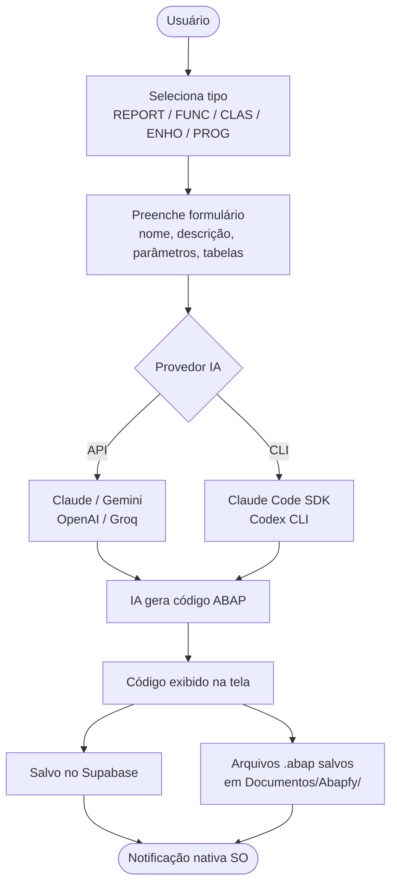
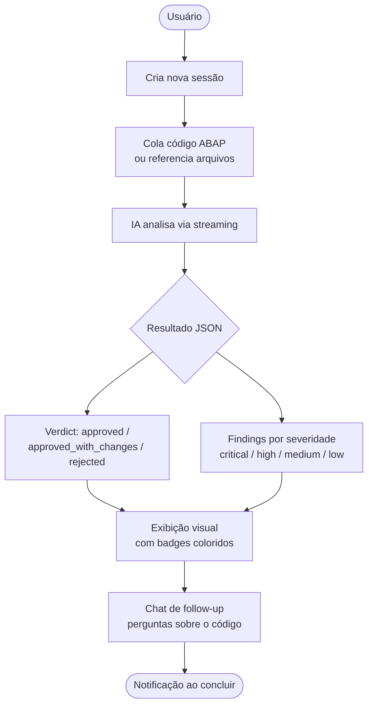
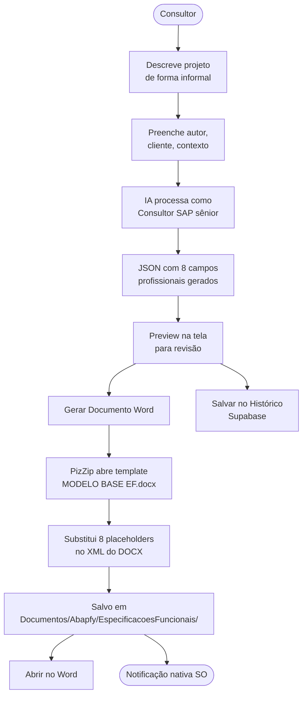

<div align="center">


# Abapfy

**Um conjunto de ferramentas com IA para a área SAP**

[](https://github.com/abapfy)
[](https://electronjs.org)
[](https://reactjs.org)
[](https://supabase.com)
[](LICENSE)

</div>

---

## 📖 Sobre

**Abapfy** é uma plataforma desktop para consultores e desenvolvedores SAP que integra Inteligência Artificial diretamente no fluxo de trabalho. Com suporte a múltiplos provedores de IA (Claude, Gemini, OpenAI, Groq e CLIs locais), o Abapfy acelera a criação de código ABAP, revisão técnica e documentação funcional.

> Interface no estilo **SAP Fiori / UI5** — familiar para quem já trabalha no ecossistema SAP.

---

## ✨ Módulos

| Módulo | Descrição | Status |
|--------|-----------|--------|
| 🔷 **Gerador ABAP** | Geração de REPORTs, Function Modules, Classes, Enhancements e programas via IA | ✅ Disponível |
| 🔍 **Code Review** | Análise estática com IA: bugs, performance, segurança, dead code, boas práticas | ✅ Disponível |
| 📋 **Especificações Funcionais** | Criação de EFs completas via IA com exportação para documento Word (.docx) | ✅ Disponível |
| ⚙️ **Configurações** | Gerenciamento de provedores de IA, temas, fontes e preferências | ✅ Disponível |

---

## 🏗️ Arquitetura

```
┌─────────────────────────────────────────────────────────┐
│                     Abapfy (Electron)                    │
│                                                         │
│  ┌──────────────┐    IPC Bridge    ┌──────────────────┐ │
│  │   Renderer   │ ◄──────────────► │  Main Process    │ │
│  │  (React 18)  │                  │  (Node.js)       │ │
│  │              │                  │                  │ │
│  │ • Views      │                  │ • AI providers   │ │
│  │ • Stores     │                  │ • DOCX engine    │ │
│  │ • Components │                  │ • File system    │ │
│  │ • Agents     │                  │ • Notifications  │ │
│  └──────┬───────┘                  └────────┬─────────┘ │
│         │                                   │           │
│         ▼                                   ▼           │
│  ┌──────────────┐                  ┌──────────────────┐ │
│  │   Supabase   │                  │   AI Providers   │ │
│  │  Auth + DB   │                  │ Claude / Gemini  │ │
│  └──────────────┘                  │ OpenAI / Groq    │ │
│                                    │ Claude Code CLI  │ │
│                                    │ Codex CLI        │ │
│                                    └──────────────────┘ │
└─────────────────────────────────────────────────────────┘
```

---

## 🔄 Fluxos de Uso

### Gerador ABAP



### Code Review



### Especificações Funcionais



---

## 🤖 Provedores de IA

O Abapfy suporta dois modelos de integração com IA:

### Via API (cloud)

| Provedor | Modelo padrão | Tipo |
|----------|---------------|------|
| **Claude** (Anthropic) | `claude-sonnet-4-6` | API REST |
| **Gemini** (Google) | `gemini-2.0-flash` | API REST |
| **OpenAI** | `gpt-4o` | API REST |
| **Groq** | `qwen/qwen3-32b` | API REST |

### Via CLI (local — sem API key)

| Ferramenta | Instalação | Tipo |
|------------|-----------|------|
| **Claude Code** | `npm install -g @anthropic-ai/claude-code` | Agent SDK |
| **Codex CLI** | `npm install -g @openai/codex` | CLI subprocess |

> 💡 As integrações CLI têm **prioridade** sobre provedores API quando habilitadas.

---

## 🗃️ Banco de Dados (Supabase)

### Tabelas

```sql
-- Programas ABAP gerados
user_abap_programs (id, user_id, name, type, result jsonb, created_at)

-- Sessões de Code Review
user_code_review_sessions (id, user_id, name, messages jsonb, created_at)

-- Especificações Funcionais
user_ef_specs (id, user_id, project_name, author, client_name,
               context_input, generated_content jsonb, status, created_at)

-- Configurações de provedores IA
user_ai_providers (id, user_id, provider, api_key, model, enabled, updated_at)

-- Agentes customizados
user_agents (id, user_id, name, prompt, created_at)
```

## 🚀 Como Rodar

### Pré-requisitos

- [Node.js](https://nodejs.org) 18+
- Conta no [Supabase](https://supabase.com) (gratuita)
- Chave de API de pelo menos um provedor IA **ou** Claude Code / Codex CLI instalado

### Instalação

```bash
# Clonar o repositório
git clone https://github.com/esc4n0rx/abapfy.git
cd abapfy

# Instalar dependências
npm install

# Rodar em modo desenvolvimento
npm run dev
```

### Build para produção

```bash
npm run build   # compila
npm run package # gera instalador
```

---

## 📁 Estrutura do Projeto

```
abapfy/
├── src/
│   ├── main/
│   │   └── index.js          # Processo principal Electron
│   │                         # IPC handlers, DOCX engine, notificações
│   ├── preload/
│   │   └── index.js          # Bridge IPC → renderer (contextBridge)
│   └── renderer/
│       └── src/
│           ├── agents/       # Prompts de sistema para cada módulo
│           │   ├── abaper.md
│           │   ├── code_review.md
│           │   ├── ef_consultant.md
│           │   └── consultor.md
│           ├── components/   # Componentes reutilizáveis
│           │   ├── Sidebar.jsx
│           │   ├── ShellBar.jsx
│           │   └── TitleBar.jsx
│           ├── docs/
│           │   └── MODELO BASE EF.docx   # Template Word para EFs
│           ├── lib/
│           │   ├── aiClient.js   # Multi-provider AI client
│           │   ├── notify.js     # Notificações nativas SO
│           │   └── supabase.js   # Supabase client
│           ├── store/            # Estado global (Zustand)
│           │   ├── abapStore.js
│           │   ├── aiStore.js
│           │   ├── authStore.js
│           │   ├── codeReviewStore.js
│           │   ├── especificacoesStore.js
│           │   └── themeStore.js
│           ├── styles/
│           │   └── global.css    # Design tokens SAP Fiori
│           └── views/            # Telas da aplicação
│               ├── AbapView.jsx
│               ├── CodeReviewView.jsx
│               ├── DashboardView.jsx
│               ├── EspecificacoesView.jsx
│               ├── LoginView.jsx
│               └── SettingsView.jsx
├── logo.png
└── package.json
```

---

## 🎨 Design System

O Abapfy usa um design system baseado em **SAP Fiori / UI5** com tokens CSS customizáveis e suporte a tema claro/escuro:

```css
--sap-shell:    #354a5e   /* Header escuro */
--sap-primary:  #0070f2   /* Azul SAP — ações principais */
--sap-positive: #107e3e   /* Verde — sucesso */
--sap-negative: #bb0000   /* Vermelho — erro */
--sap-critical: #e9730c   /* Laranja — aviso */
```

---

## 📦 Stack Tecnológico

| Tecnologia | Versão | Função |
|-----------|--------|--------|
| **Electron** | 28 | Runtime desktop multiplataforma |
| **React** | 18 | Interface de usuário |
| **Vite / electron-vite** | 5 | Build tool e dev server |
| **Supabase** | v2 | Auth, banco de dados e backend |
| **Zustand** | 4 | Gerenciamento de estado |
| **React Router** | 6 | Roteamento SPA |
| **PizZip** | 3 | Manipulação de arquivos DOCX |
| **React Markdown** | 10 | Renderização de markdown |
| **Claude Agent SDK** | 0.2 | Integração com Claude Code CLI |

---

## 📋 Changelog

### v1.0.1 — Março 2026
- ✅ Módulo **Especificações Funcionais** com geração de DOCX via IA
- ✅ **Notificações nativas** do SO ao concluir geração (ABAP, Code Review, EF)
- ✅ Dashboard com dados reais dos módulos e alerta de configuração IA
- ✅ Renomeação do projeto para **Abapfy**
- ✅ Suporte ao template `MODELO BASE EF.docx` com substituição de 8 placeholders

### v1.0.0 — Março 2026
- ✅ Gerador ABAP com suporte a 5 tipos de objeto
- ✅ Code Review com chat interativo e análise JSON estruturada
- ✅ Suporte a 4 provedores de IA via API + 2 integrações CLI
- ✅ Autenticação e persistência via Supabase
- ✅ Tema claro/escuro com design SAP Fiori

---

## 🤝 Contribuindo

Pull requests são bem-vindos! Para mudanças maiores, abra uma issue primeiro para discutir o que você gostaria de mudar.

---

<div align="center">

**Abapfy** · Construído com ❤️ para a comunidade SAP

</div>
